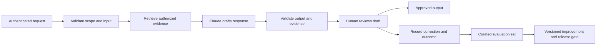

# Domain 1 — Solution Design & Architecture

Blueprint weight: **17%**, from the supplied guide. Objective IDs below follow its bullet order. This independent study material does not establish the guide's public authenticity. Source facts are linked; worked decisions, thresholds, examples, and exercises are instructional recommendations, not Anthropic requirements. Research checked 2026-09-24.

## D1.1 — Translate business problems into Claude-based AI solutions

A business problem states an undesirable outcome; an AI use case identifies where probabilistic language understanding can improve it. “We need an agent” is a proposed implementation. “Support spends nine minutes finding policy evidence before drafting a reply” is a problem that can be measured.

Build a decision brief before selecting models:

| Question | Support example | Architectural consequence |
|---|---|---|
| Who makes the decision? | A support representative approves replies | Generate drafts with evidence; preserve review |
| What is the unit of success? | Correctly resolved eligible ticket | Measure resolution, not answer count |
| What is uncertain? | Intent, paraphrases, incomplete explanations | Claude can classify and draft |
| What is deterministic? | Account ownership, refund eligibility rules | Application code and authoritative services enforce these |
| What can go wrong? | Wrong policy, disclosure, duplicate action | Authorization, citations, abstention, action ledger |
| What is the baseline? | Current manual workflow | Compare total handling time and rework |

An effective boundary gives Claude language tasks while keeping business invariants explicit. For example, Claude can extract a purchase date from a message, but an order service should confirm the purchase and calculate eligibility. A confidently extracted date is not an authenticated fact.

Reject AI when a stable rule or database query meets the need more reliably. A exact order-status lookup may need no model; explaining several contradictory policy passages may benefit from one. Anthropic recommends starting with simple approaches and adding complexity when measured outcomes justify it. [Building effective agents](https://www.anthropic.com/engineering/building-effective-agents)

## D1.2 — Design the complete input → processing → output → feedback loop

An end-to-end architecture includes failure handling and the system of record, not merely a model call. Use this reference flow for a draft-only assistant:

Define a contract at each arrow: schema, owner, timeout, allowed data, retry policy, and failure result. A retrieval timeout must not silently turn an evidence-grounded assistant into a general-knowledge answerer. A safe degraded response could state that current policy is unavailable and queue the ticket for review.

Separate **control state** from conversation. Store run ID, selected policy version, completed stages, approval state, and action identifiers in durable application state. A model summary is useful working context but should not be the only record that an external action occurred.

For actions, distinguish request accepted, action committed, and response delivered. If a timeout follows a committed refund, blindly repeating the call can duplicate effects. An idempotency key and outcome lookup allow reconciliation only when the executor and downstream system actually honor that contract; a local action ID alone does not make the side effect idempotent. A retry is reasonable for a transient read; a write requires knowledge of whether it happened.

**Hypothetical write contract:** scope the stable key to tenant and operation; bind it to a canonical hash of the approved parameters. The downstream service must atomically deduplicate with the side effect (or provide an equivalent documented guarantee), return the original outcome on a matching replay, and reject the same key with changed parameters. Specify the deduplication lifetime and an outcome lookup. Test the sequence: external commit → caller crash before recording success → retry with the same key → one effect and the original outcome. If the downstream provider offers neither safe deduplication nor reliable reconciliation, an unknown write remains pending for investigation; do not automatically retry it as a new transaction. These are proposed application-contract requirements, not guarantees of arbitrary APIs.

Feedback loops need curation. A thumbs-up may mean “friendly,” not “correct.” Route reviewer edits into labeled categories such as missing evidence, wrong interpretation, and tone. Keep a held-out test set; automatically treating all production feedback as trusted instruction creates a route for quality regressions and malicious influence.

## D1.3 — Choose workflow, agentic, and augmented-LLM patterns

An **augmented LLM** combines a model with capabilities such as retrieval, tools, or memory. A **workflow** follows application-defined paths. An **agent** chooses its next steps dynamically. These categories overlap: a workflow can contain an agentic research stage. [Pattern definitions](https://www.anthropic.com/engineering/building-effective-agents)

| Pattern | Prefer when | Cost and failure exposure | When an alternative wins |
|---|---|---|---|
| Single augmented call | One retrieval and synthesis step is sufficient | Few moving parts; missing evidence remains possible | A workflow wins when mandatory checks have a fixed order |
| Fixed workflow | Required stages and exits are known | More calls; easier stage-level tests | An agent wins when useful next steps depend on discoveries |
| Bounded agent loop | Investigations need adaptive tool use | Variable duration, loops, accumulating errors | A fixed path wins under tight latency or audit constraints |
| Human-assisted workflow | Wrong decisions have material consequences | Review cost and queues | Automation wins for a validated low-risk subset |

**Example:** Generating a weekly report from three known tables is a workflow: query, validate totals, summarize, approve. Investigating why a customer cannot log in may need adaptive steps: inspect account state, discover an identity-provider error, then consult a new runbook. Even there, resetting authentication should remain a separately authorized operation.

Use a bounded loop contract: maximum elapsed time, spend limit, tool-call count, meaningful progress condition, and explicit completion evidence. A model saying “done” is an assertion; verify the artifact or external result. Tool responses provide environmental feedback that agents can use to adjust their plan. [Agent execution](https://www.anthropic.com/engineering/building-effective-agents)

## D1.4 — Design multi-agent systems and orchestration

Multiple agents are useful when work can be divided into independently valuable investigations or specialized responsibilities. They are poor compensation for an unclear task. Anthropic's research-system report describes parallel exploration alongside coordination, evaluation, and token-cost challenges; its results are evidence about that implementation, not a universal speedup guarantee. [Multi-agent research system](https://www.anthropic.com/engineering/multi-agent-research-system)

For a vendor comparison, a coordinator can give separate agents distinct vendors and a common rubric. Each worker returns claims, source URLs, retrieval dates, unresolved questions, and confidence grounded in evidence. A synthesizer compares artifacts; a reviewer checks material claims against sources.

| Orchestration | Useful situation | Main trade-off |
|---|---|---|
| Parallel independent workers | Compare unrelated vendors or document collections | Lower elapsed time may increase total token usage |
| Sequential handoff | Analysis must consume a validated prior result | Strong dependency clarity, longer critical path |
| Coordinator with dynamic workers | Required subtasks emerge during investigation | Flexible scope, harder cost and completion control |
| Independent review | Error detection needs a different perspective | Additional cost; correlated errors remain |

Define ownership before execution. Workers should not concurrently modify the same record without coordination. Give each a task boundary, authorized tools, input snapshot, output schema, deadline, and evidence requirement. A coordinator should detect redundant searches, conflicting findings, and missing tasks.

Consensus is not truth. Three agents sharing the same stale source may agree incorrectly. Diversity of evidence, independent validation, and deterministic checks often matter more than agent count. If the report depends on one inaccessible contract, additional agents cannot manufacture the missing evidence.

## D1.5 — Apply decomposition to complex problems

Decomposition converts an ambiguous objective into smaller tasks with explicit dependencies and measurable outputs. Choose boundaries that reduce uncertainty or permit independent verification. Splitting a simple answer into ten arbitrary model calls creates overhead without useful isolation.

Consider “prepare an incident review.” Useful stages are: collect events, normalize timestamps, build a supported timeline, identify contributing factors, propose actions, and verify claims. Timeline construction depends on collected events. Independent service-log collection can run in parallel. Recommendations should consume the verified timeline, rather than speculation from early partial logs.

For each subtask specify:

1. **Inputs:** Which facts, permissions, and versions are available?
2. **Output contract:** What must a downstream consumer be able to rely on?
3. **Acceptance evidence:** Schema validity, source support, tests, or human approval?
4. **Failure semantics:** Retry, abstain, request evidence, or escalate?
5. **Merge policy:** How are duplicate or conflicting outputs reconciled?

Separate decomposition from parallelization. A dependency graph can expose both sequential and parallel work. If independent steps take 2, 4, and 7 seconds, idealized parallel execution takes at least 7 seconds plus coordination, rather than 13; real limits include quotas, contention, and slow outliers. Measure actual p95 completion under load.

Failure modes include lost context at handoff, locally correct outputs that violate the global objective, circular review loops, and summaries that erase caveats. Require workers to retain unresolved questions and source references. Make the coordinator responsible for the complete objective rather than simply concatenating submissions.

## D1.6 — Align decisions with business value and performance SLAs

The five blueprint value pillars are related but not interchangeable:

| Pillar | Operational definition | Useful measurement | Misleading substitute |
|---|---|---|---|
| Efficiency | Less effort per existing task | Handling time including corrections | Model response speed alone |
| Transformation | A previously impractical capability becomes viable | Newly served cases with acceptable outcomes | Number of agents deployed |
| Productivity | More useful work per person or team | Accepted cases per reviewer-hour | Draft volume |
| Cost | Total resources consumed | Cost per successful eligible case | Token price alone |
| Performance SLAs | Agreed service behavior | End-to-end latency, availability, completion | Average model-call latency |

For a worked estimate, suppose a draft saves four minutes but adds one minute of review, and 20% of cases need two minutes of rework. Expected labor saved is `4 − 1 − 0.2 × 2 = 2.6 minutes`. Include infrastructure, model calls, integration maintenance, and incident handling before calling this a financial benefit. These figures are illustrative.

Distinguish an internal **SLO** from a contractual **SLA**. Specify the measured population, percentile, clock boundaries, exclusions, and fallback. “Fast” might mean first visible text; successful completion also includes retrieval, tool calls, validation, and approval. Streaming can improve perceived responsiveness without reducing the time to a validated result.

Prefer the least costly design that satisfies quality and risk constraints. A faster design that fails evidence requirements is not on the feasible frontier. Conversely, adding a second agent for negligible quality improvement can consume the entire latency budget.

## Practical lab — Architect a policy-support assistant

Produce a decision brief, diagram, dependency graph, failure table, and one-page architecture decision record. Assume 10,000 eligible tickets per week, human-approved replies, two policy versions, and a five-second draft SLO. Numbers are training constraints.

Compare a single RAG call, fixed workflow, and bounded agent. Identify the smallest defensible first release and the evidence that would justify adding agents. Simulate one retrieval outage, one conflicting-policy result, and one timeout after the approved reply is recorded in the ticket system. For this write extension, define an application-generated reply ID, an idempotent create-or-return operation, and a read-back query that reconciles an ambiguous timeout before retrying.

**Acceptance criteria:** every blueprint objective has a concrete decision; the diagram includes feedback and fallback; permission checks precede data access; every write has a reconciliation strategy; the cost estimate includes human review; the SLO measures end-to-end draft delivery; at least two rejected alternatives include conditions under which they would win. A peer should be able to explain how the system fails without inventing missing components.

## Original practice questions — not official exam items

**1. Select ONE.** A nightly document summary always follows parse → extract → validate → summarize. Which initial architecture is most defensible?

A. Unbounded autonomous agent. B. Fixed workflow. C. Five debating agents. D. Free-form generation without validation.

**Answer: B.** A adds unnecessary autonomy to known steps. B preserves stage contracts and predictable control. C adds coordination without independent tasks. D removes a required validity check.

**2. Select TWO.** Three research workers often duplicate effort and return incompatible results. Which changes address the architecture?

A. Give each a non-overlapping scope and common output contract. B. Increase temperature. C. Require evidence and a coordinator merge policy. D. Treat majority agreement as proof.

**Answer: A, C.** A addresses overlap and compatibility. B does not define responsibilities. C makes disagreements inspectable. D can amplify shared errors.

**3. Select ONE.** Draft latency falls 40%, but reviewer time doubles and accepted resolutions are unchanged. What best assesses business value?

A. Celebrate the latency gain as productivity. B. Measure total cost and reviewer effort per accepted resolution. C. Count generated drafts. D. Add more agents immediately.

**Answer: B.** A confuses component performance with the outcome. B captures displaced work. C rewards volume independent of quality. D changes implementation before diagnosis.

**4. Select ONE.** A payment tool times out after it may have committed. What should the orchestrator do first?

A. Retry with a new transaction ID. B. Ask Claude whether it probably succeeded. C. Reconcile using the existing action ID or idempotency mechanism. D. Mark it failed and forget it.

**Answer: C.** A risks duplication. B is not authoritative transaction evidence. C resolves uncertain side effects. D loses an operation that may have completed.

**5. Select TWO.** Which tasks are good candidates for parallel execution in an incident review?

A. Collect independent service logs. B. Produce final causes before any evidence. C. Independently check timeline claims against source logs. D. Apply two conflicting edits to the same record.

**Answer: A, C.** A separates independent collection. B violates evidence dependencies. C can review different claims concurrently once a timeline exists. D needs serialized ownership or conflict handling.

**6. Select ONE.** A bounded agent hits its budget with a partial artifact. What is the best output contract?

A. Claim completion to meet the deadline. B. Return partial work, verified evidence, remaining tasks, and an explicit incomplete status. C. Restart silently without a limit. D. Discard everything.

**Answer: B.** A hides unmet requirements. B permits safe handoff and resumption. C defeats cost control. D wastes useful verified progress.
